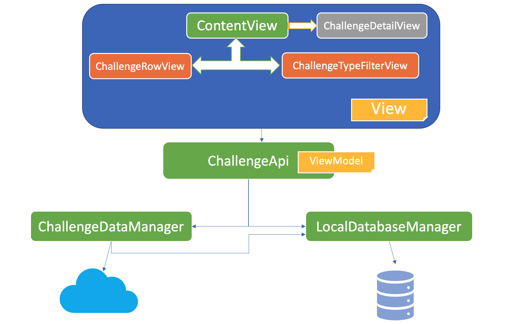
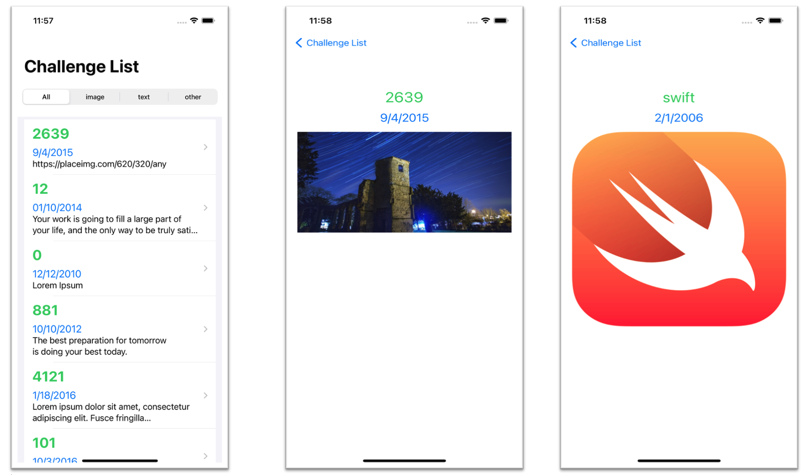
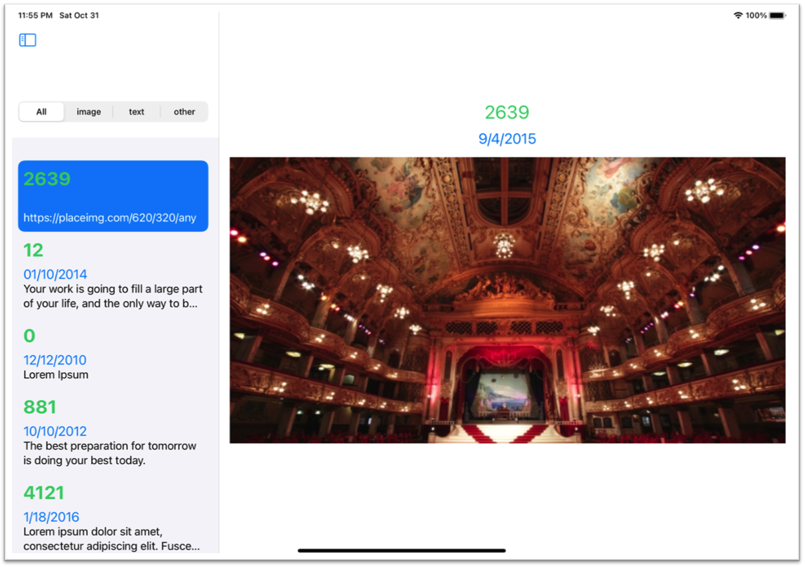
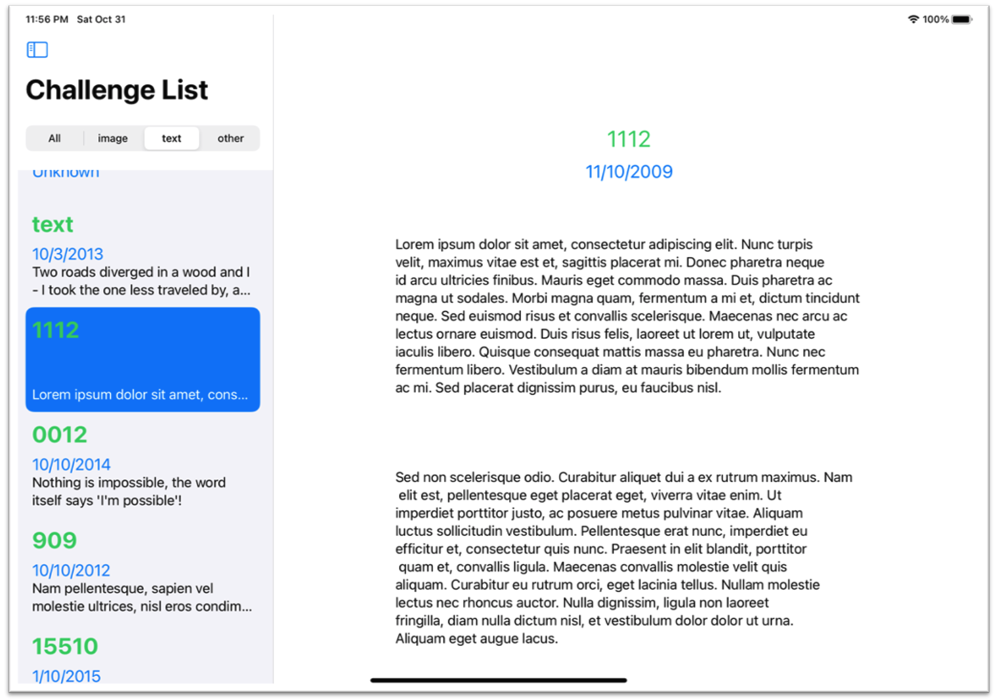

# CavistaChallenge

This repository is created for the iOS challenge given by Cavista. 
Challenge details can be found [here](https://github.com/MobileAxxess/iOS-Code-Challenge).

---

# iOSChallenge

A simple iOS App that loads data from server on launch and stored it in local storage for offline purpose. After loading App shows list of data with option to short as per the type of data (image,text & other). 

On click of any item, detailed view is shown. 

## App Design

The whole App is divided into three main components: 
	
	1. View - Responsible for creating Views for showing list and their detailed view.
	2. ViewModel - Responsible for interacting with Model components for getting server data and perocessing it for showing on view. This works as bridge between Model and View. 
	3. Model - Data handling layer for fetching, storging and manupulating data.  

## Component Design

## App Screenshots

